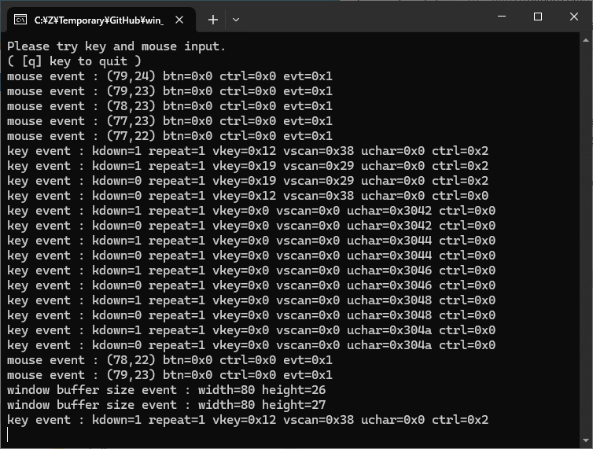
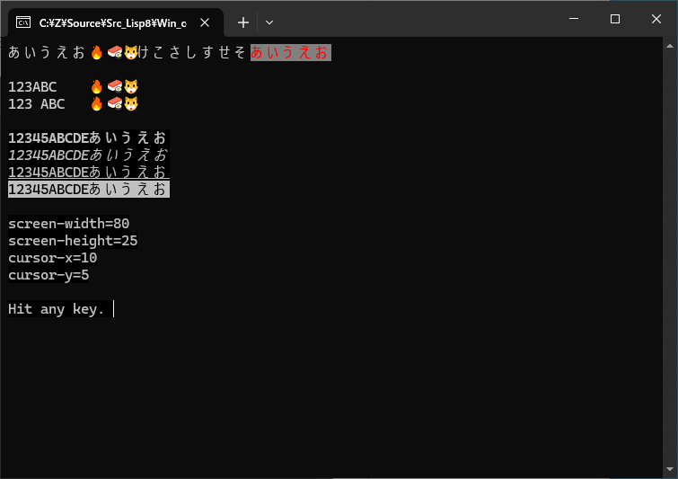
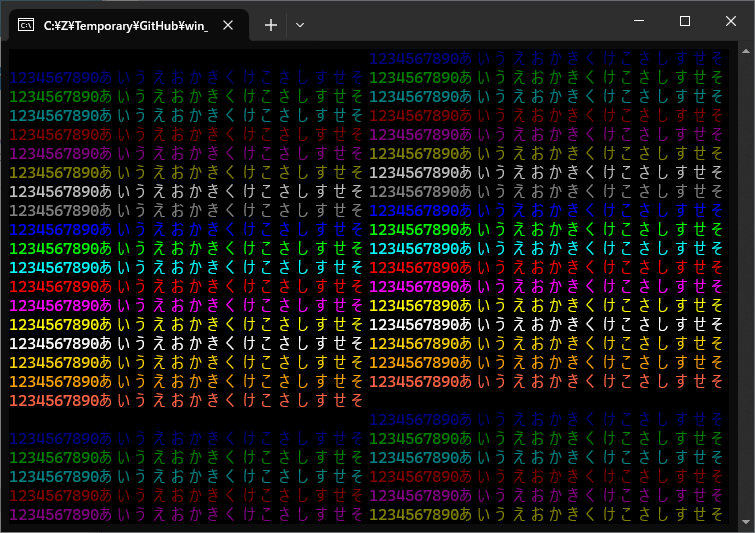

# win_console_test

## 概要
- Windows Terminal で、入出力を確認する C のテストプログラムです。  
  (Windows Terminal でしか動作しないため、Windows 10 以降が必要です)


## インストール方法
1. MSYS2/MinGW-w64 (64bit) のインストール  
   事前に MSYS2/MinGW-w64 (64bit) がインストールされている必要があります。  
   以下のページを参考に、開発環境のインストールを実施ください。  
   https://gist.github.com/Hamayama/eb4b4824ada3ac71beee0c9bb5fa546d  
   (すでにインストール済みであれば本手順は不要です)  
   (記事が古いので、現状と合っていないかもしれない)

2. 本プログラムのコンパイル  
   0000_compile.bat を (ダブルクリック等で) 実行してください。

3. 本プログラムの実行  
   1000_exec_input.bat  で、入力確認のテストプログラムを起動します。  
   1001_exec_output.bat で、出力確認のテストプログラムを起動します。


## 実行結果
1. 入力確認のテストプログラム  
   (キー入力、漢字入力、マウス操作、画面サイズ変更を検出できます)
   


2. 出力確認のテストプログラム  
   (座標を指定して文字列を出力できます。また、文字の属性 (bold, italic, underline, reverse) を指定できます)  
     
   (RGB 各 8 ビットの 24 ビットカラーを指定できます)  
   


## 内容
1. win_con_lib_1000.h に以下のコンソール入出力の関数を定義しています。  
   ```
   BOOL init_screen(DWORD *con_input_mode_orig, DWORD *con_output_mode_orig);
   BOOL end_screen(int restore_on, DWORD con_input_mode_orig, DWORD con_output_mode_orig);
   BOOL clear_screen(void);
   BOOL get_screen_size(int *w, int *h);
   BOOL set_foreground_color_rgb24(int r, int g, int b);
   BOOL set_background_color_rgb24(int r, int g, int b);
   BOOL set_bold(int on);
   BOOL set_italic(int on);
   BOOL set_underline(int on);
   BOOL set_reverse(int on);
   BOOL get_cursor_position(int *x, int *y);
   BOOL set_cursor_position(int  x, int  y);
   BOOL set_cursor_visible(int on);
   BOOL write_console_utf8(char *str);
   BOOL write_console_utf16(WCHAR *wstr);
   BOOL read_console_input(WORD *event_type,
                           BOOL *kdown, WORD *repeat, WORD *vkey, WORD *vscan, WCHAR *uchar, DWORD *ctrl,
                           SHORT *mouse_x, SHORT *mouse_y, DWORD *mouse_button, DWORD *mouse_ctrl, DWORD *mouse_event_flag);
   ```

2. 24 ビットカラーと属性 (bold, italic, underline, reverse) の指定は、  
   VT エスケープシーケンスで行っています。  
   ( https://learn.microsoft.com/ja-jp/windows/console/console-virtual-terminal-sequences )  
   それ以外は、Windows API を使用しています。


## TODO
1. DLL化


## 環境等
- OS
  - Windows 10 (version 22H2) (64bit)
- 環境
  - MSYS2/MinGW-w64 (64bit) (gcc version 14.2.0 (Rev2, Built by MSYS2 project))


## 履歴
- 2025-1-16 v1.00 (初版)


(2025-1-16)
